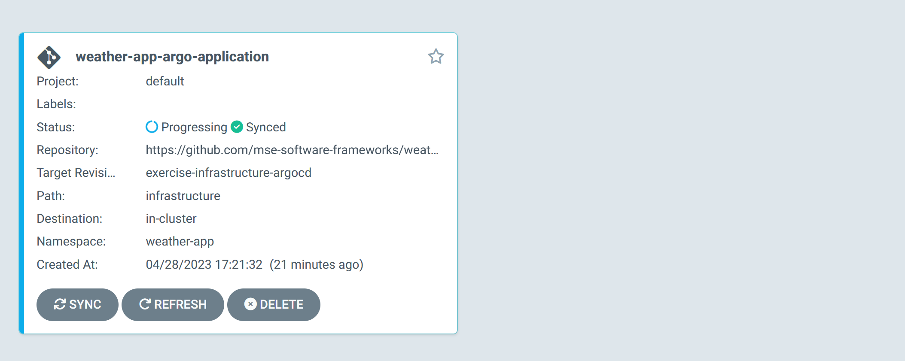
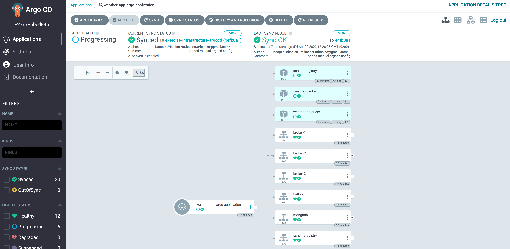
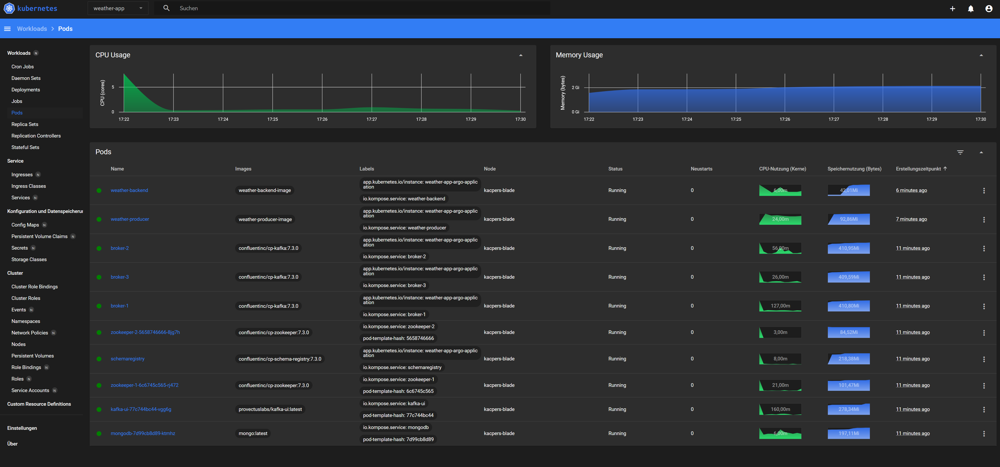
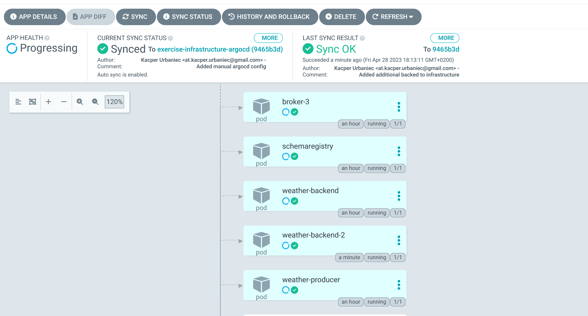
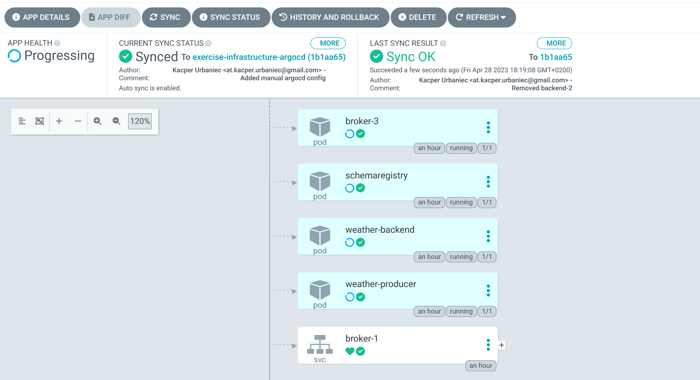

## GitOps Notes

>  Tested on WSL2

Install 

```
curl -sfL https://get.k3s.io | sh -
```

Start

```
sudo k3s server 
```

Check

>  Use `kubectl` without sudo
>
> ```
> sudo chmod 644 /etc/rancher/k3s/k3s.yaml
> ```

```
kubectl cluster-info && kubectl get nodes && kubectl get pods --all-namespaces
```

### Kubernetes Dashboard

Install

```
GITHUB_URL=https://github.com/kubernetes/dashboard/releases
VERSION_KUBE_DASHBOARD=$(curl -w '%{url_effective}' -I -L -s -S ${GITHUB_URL}/latest -o /dev/null | sed -e 's|.*/||')
sudo k3s kubectl create -f https://raw.githubusercontent.com/kubernetes/dashboard/${VERSION_KUBE_DASHBOARD}/aio/deploy/recommended.yaml
```

Dashboard RBAC Configuration & deployment

```
cd infrastructure
sudo k3s kubectl create -f dashboard.admin-user.yml -f dashboard.admin-user-role.yml
```

Obtain the Bearer Token

```
sudo k3s kubectl -n kubernetes-dashboard create token admin-user
```

Create channel

```
sudo k3s kubectl proxy
```

The Dashboard is now accessible at:

- http://localhost:8001/api/v1/namespaces/kubernetes-dashboard/services/https:kubernetes-dashboard:/proxy/
- `Sign In` with the `admin-user` Bearer Token


### Build Containers for Weather Producer & Weather Backend

```
cd WeatherApp
docker build -t weather-producer-image -f Dockerfile.producer .
```

> Remove `WeatherApp.Backend/data` before running `docker build`

```
docker build -t weather-backend-image -f Dockerfile.backend .
```


### Translate Docker Compose to Kubernetes Resources

First move local images to k3s

```
cd infrastructure
docker save weather-producer-image | sudo k3s ctr images import --digests -
docker save weather-backend-image | sudo k3s ctr images import --digests -
```

Install Kompose

```
curl -L https://github.com/kubernetes/kompose/releases/download/v1.26.0/kompose-linux-amd64 -o kompose
chmod +x kompose
sudo mv ./kompose /usr/local/bin/kompose
```

Convert `docker-compose`

```
cd infrastructure
kompose convert
```

> ⚠️ Some necessary manual modifications were made to the generated service files as some (internal) port were missing that are required for proper functionality.

Run cluster

```
kubectl apply -f .
```


### Test

Test if cluster is running but first proxy `kafka ui` to localhost

```
kubectl port-forward deployment/kafka-ui 8080:8080
```

Access UI at http://localhost:8080/ui


Check if .NET apps write data via dashboard


## GitOps with ArgoCD

Install ArgoCD

```
kubectl create namespace argocd
kubectl apply -n argocd -f https://raw.githubusercontent.com/argoproj/argo-cd/stable/manifests/install.yaml
```

Change the argocd-server service type to LoadBalancer:

```
kubectl patch svc argocd-server -n argocd -p '{"spec": {"type": "LoadBalancer"}}'
```

Forward ArgoCD port to 8080

```
kubectl port-forward svc/argocd-server -n argocd 8080:443
```

Then get the initial password for the admin-user

```
argocd admin initial-password -n argocd
```

> Command requires ArgoCD Cli to be installed. One can obtain it on Mac via
>
> ```
> brew install argocd
> ```
>
> or for other systems from https://github.com/argoproj/argo-cd/releases/latest
>
> Alternatively one can obtain the password manually without the cli tool via
>
> ```
> kubectl get secret argocd-initial-admin-secret -n argocd -o yaml
> ```
>
> The given password is encoded and can be decoded via `base64 --decode <password>`

And login to https://localhost:8080 using 'admin' and the password.


### Setup Weather-App Infrastructure

To register infrastructure one must create ArgoCD applications. One can do it via UI or declare it like in the following via a declarative kubernetes resource.

```yaml
apiVersion: argoproj.io/v1alpha1
kind: Application
metadata:
  name: weather-app-argo-application
  namespace: argocd
spec:
  project: default

  source:
    repoURL: https://github.com/mse-software-frameworks/weather-app
    targetRevision: exercise-infrastructure-argocd
    path: infrastructure
  destination: 
    server: https://kubernetes.default.svc
    namespace: weather-app

  syncPolicy:
    syncOptions:
    - CreateNamespace=true

    automated:
      selfHeal: true
      prune: true
```

The most important aspects of the configuration are the source and destination properties. The source marks the remote git repository where all infrastructure is declared as IaC. Here we are reusing our existing GitHub repository for it but specifying that ArgoCD should only inspect the `infrastructure` directory of the `exercise-infrastructure-argocd` branch. The destination is the running kubernetes instance. When running locally one can simply use `https://kubernetes.default.svc`.

In the policies section `selfHeal` and `prune` were explicitly specified. That means that local changes to infrastructure (e.g. manually editing the resources by hand) are prohibited and will be automatically reverted. Also, removing a resource configurations in the repository will lead to termination and removal of the corresponding running resource in kubernetes on sync.

Creating an ArgoCD application is the only time one must manually apply a configuration in GitOps. After that ArgoCD will be solely responsible for managing the registered infrastructure.

```
kubectl apply -f argocd.yaml
```

Returning to https://localhost:8080 one should see the new application created.



The application is now running and one can now view its resource components, logs, events, and assessed health status.



Our infrastructure seems not to support ArgoCD's health check feature, however it is running fine as visible by the status in the kubernetes dashboard.




### GitOps Workflow

To test the configured GitOps environment a second backend resource was created & commited/pushed to the remote git repository.

```yaml
# weather-backend-2-pod.yaml
apiVersion: v1
kind: Pod
metadata:
  annotations:
    kompose.cmd: kompose convert
    kompose.version: 1.26.0 (40646f47)
  creationTimestamp: null
  labels:
    io.kompose.service: weather-backend-2
  name: weather-backend-2
spec:
  containers:
    - image: weather-backend-image
      name: weather-backend-2
      imagePullPolicy: Never
      resources: {}
  restartPolicy: OnFailure
status: {}
```

Now one can wait on default 3 minutes which is the standard manual pull loop for ArgoCD or just click *REFRESH* in the dashboard to pull changes manually. ArgoCD should realize that there is a new commit and for a short period of time it will state *OutOfSync* and flash yellow. Shortly after that the changes should be applied, ArgoCD once again be in sync and a new pod called `weather-backend-2` should be listed and running.



Now, as our ArgoCD application has been configured with pruning support, when one deletes the `weather-backend-2-pod.yaml` config and pushes the change to the repository, ArgoCD will terminate and remove the associated running pod `weather-backend-2`.




## Sources

* https://docs.k3s.io/quick-start
* https://boxofcables.dev/deploying-rancher-on-k3s-on-wsl2/
* https://www.guide2wsl.com/k3s/
* https://stackoverflow.com/a/73425733
* https://docs.k3s.io/installation/kube-dashboard
* https://learn.microsoft.com/en-us/dotnet/core/docker/build-container?tabs=windows
* https://stackoverflow.com/a/72928176
* https://stackoverflow.com/questions/47928827/how-to-install-rocksdb-into-ubuntu
* https://kubernetes.io/docs/tasks/configure-pod-container/translate-compose-kubernetes/
* https://argo-cd.readthedocs.io/en/stable/operator-manual/declarative-setup/#applications
* https://argo-cd.readthedocs.io/en/stable/getting_started/
* https://www.youtube.com/watch?v=MeU5_k9ssrs