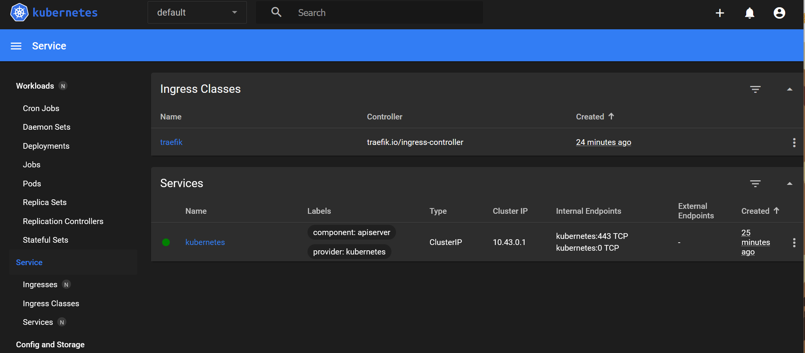
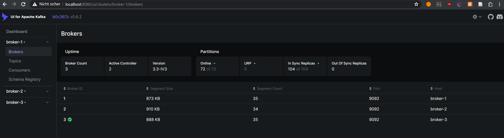
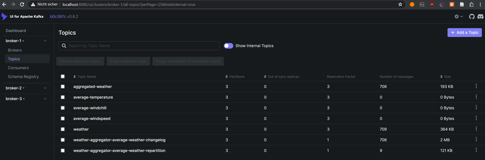
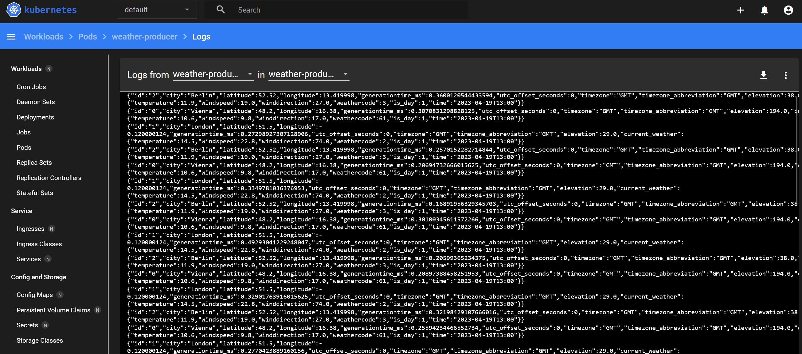
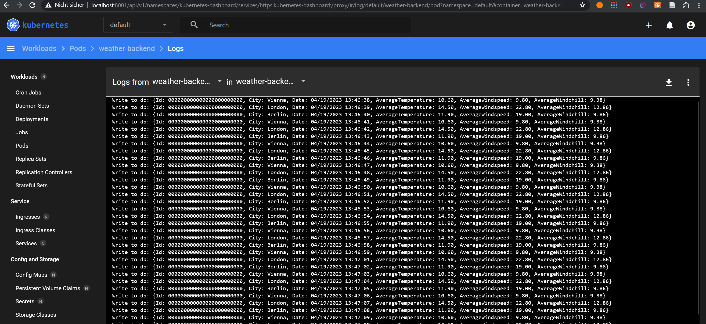
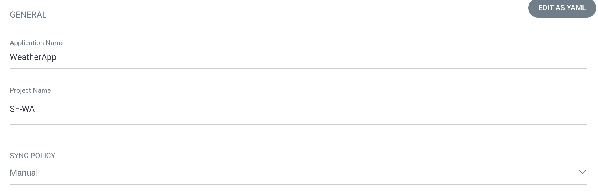
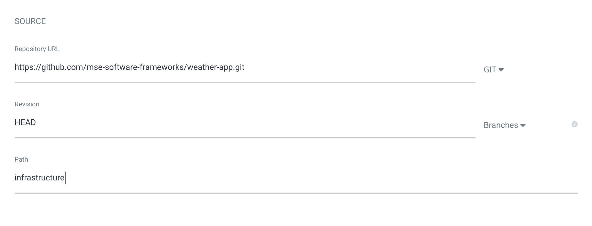
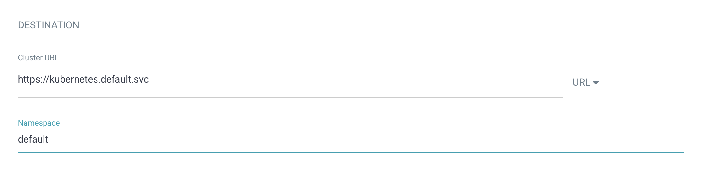

## GitOps Notes

>  Tested on WSL2

Install 

```
curl -sfL https://get.k3s.io | sh -
```

Start

```
sudo k3s server 
```

Check

>  Use `kubectl` without sudo
>
> ```
> sudo chmod 644 /etc/rancher/k3s/k3s.yaml
> ```

```
kubectl cluster-info && kubectl get nodes && kubectl get pods --all-namespaces
```

### Kubernetes Dashboard

Install

```
GITHUB_URL=https://github.com/kubernetes/dashboard/releases
VERSION_KUBE_DASHBOARD=$(curl -w '%{url_effective}' -I -L -s -S ${GITHUB_URL}/latest -o /dev/null | sed -e 's|.*/||')
sudo k3s kubectl create -f https://raw.githubusercontent.com/kubernetes/dashboard/${VERSION_KUBE_DASHBOARD}/aio/deploy/recommended.yaml
```

Dashboard RBAC Configuration & deployment

```
cd infrastructure
sudo k3s kubectl create -f dashboard.admin-user.yml -f dashboard.admin-user-role.yml
```

Obtain the Bearer Token

```
sudo k3s kubectl -n kubernetes-dashboard create token admin-user
```

Create channel

```
sudo k3s kubectl proxy
```

The Dashboard is now accessible at:

- http://localhost:8001/api/v1/namespaces/kubernetes-dashboard/services/https:kubernetes-dashboard:/proxy/
- `Sign In` with the `admin-user` Bearer Token



### Build Containers for Weather Producer & Weather Backend

```
cd WeatherApp
docker build -t weather-producer-image -f Dockerfile.producer .
```

> Remove `WeatherApp.Backend/data` before running `docker build`

```
docker build -t weather-backend-image -f Dockerfile.backend .
```


### Translate Docker Compose to Kubernetes Resources

First move local images to k3s

```
cd infrastructure
docker save weather-producer-image | sudo k3s ctr images import --digests -
docker save weather-backend-image | sudo k3s ctr images import --digests -
```

Install Kompose

```
curl -L https://github.com/kubernetes/kompose/releases/download/v1.26.0/kompose-linux-amd64 -o kompose
chmod +x kompose
sudo mv ./kompose /usr/local/bin/kompose
```

Convert `docker-compose`

```
cd infrastructure
kompose convert
```

> ⚠️ Some necessary manual modifications were made to the generated service files as some (internal) port were missing that are required for proper functionality.

Run cluster

```
kubectl apply -f .
```


### Test

Test if cluster is running but first proxy `kafka ui` to localhost

```
kubectl port-forward deployment/kafka-ui 8080:8080
```

Access UI at http://localhost:8080/ui






Check if .NET apps write data via dashboard






## GitOps with ArgoCD

Install ArgoCD

```
kubectl create namespace argocd
kubectl apply -n argocd -f https://raw.githubusercontent.com/argoproj/argo-cd/stable/manifests/install.yaml
```

Change the argocd-server service type to LoadBalancer:

```
kubectl patch svc argocd-server -n argocd -p '{"spec": {"type": "LoadBalancer"}}'
```

Forward ArgoCD port to 8080

```
kubectl port-forward svc/argocd-server -n argocd 8080:443
```

Then get the initial password for the admin-user

```
argocd admin initial-password -n argocd
```

> Requires ArgoCD Cli, eg. on Mac 
>
> ```
> brew install argocd
> ```
>
> or from  https://github.com/argoproj/argo-cd/releases/latest
>
> Alternatively one can obtain the password manually via
>
> ```
> kubectl get secret argocd-initial-admin-secret -n argocd -o yaml
> ```
>
> The given password must be decoded via `base64 --decode <password>`

And login to https://localhost:8080 using 'admin' and the password.


Click on create and enter the form.




for path, choose the path of the deployment yaml



and click on create. 

The application is now running and you can now view its resource components, logs, events, and assessed health status.

## Sources

* https://docs.k3s.io/quick-start
* https://boxofcables.dev/deploying-rancher-on-k3s-on-wsl2/
* https://www.guide2wsl.com/k3s/
* https://stackoverflow.com/a/73425733
* https://docs.k3s.io/installation/kube-dashboard
* https://learn.microsoft.com/en-us/dotnet/core/docker/build-container?tabs=windows
* https://stackoverflow.com/a/72928176
* https://stackoverflow.com/questions/47928827/how-to-install-rocksdb-into-ubuntu
* https://kubernetes.io/docs/tasks/configure-pod-container/translate-compose-kubernetes/