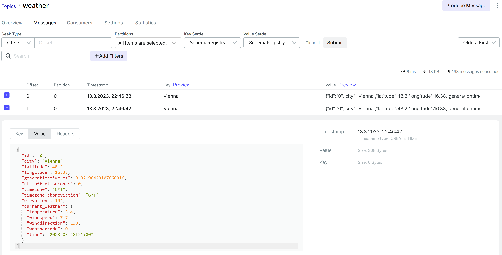
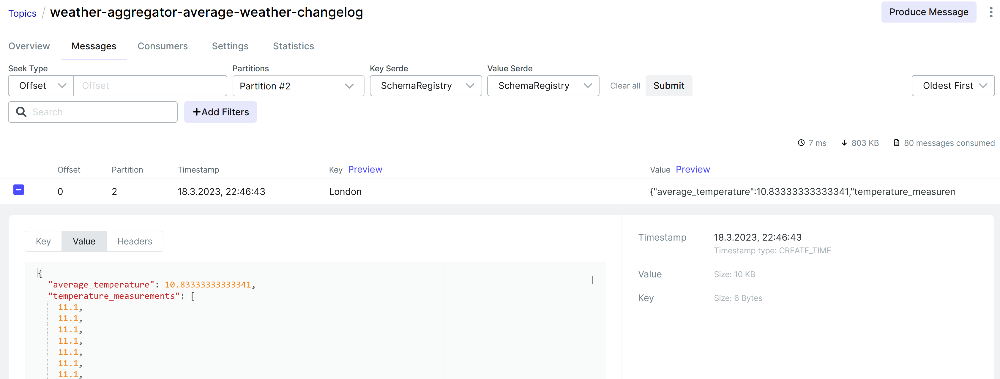
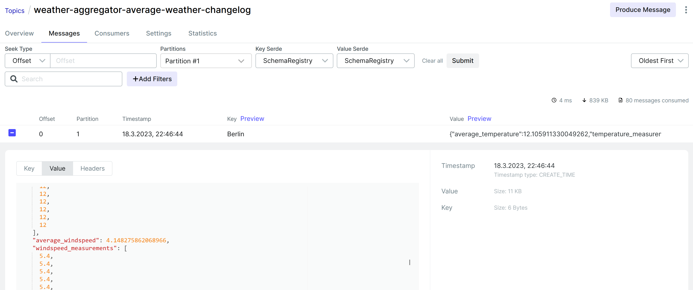
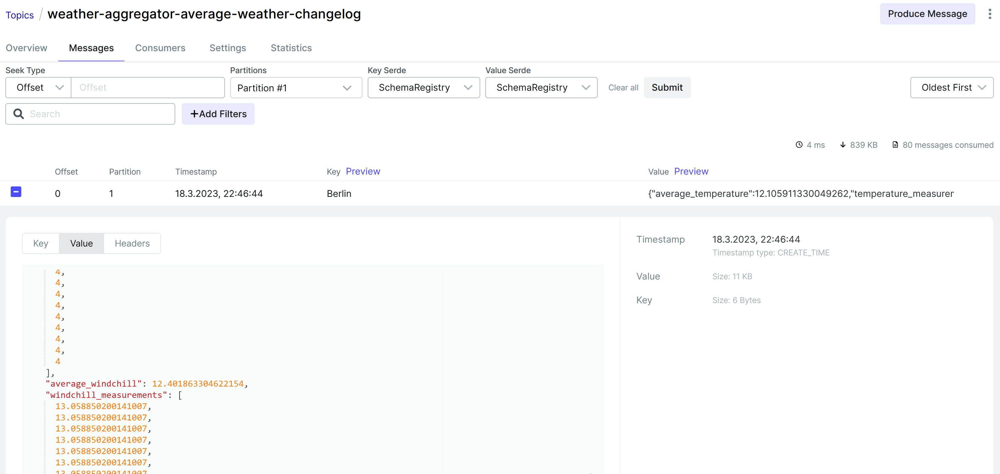
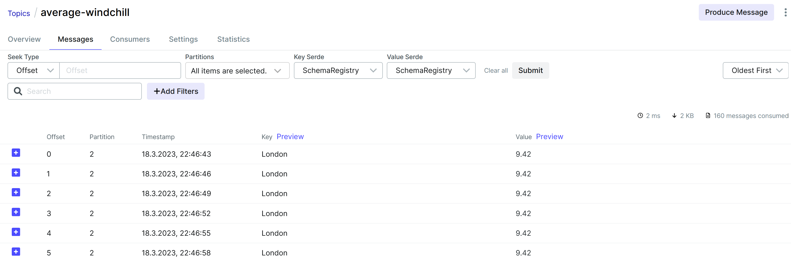
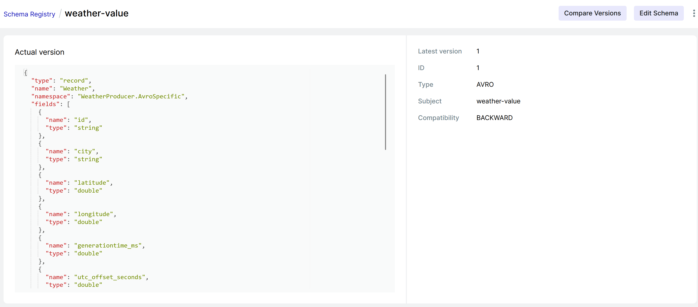
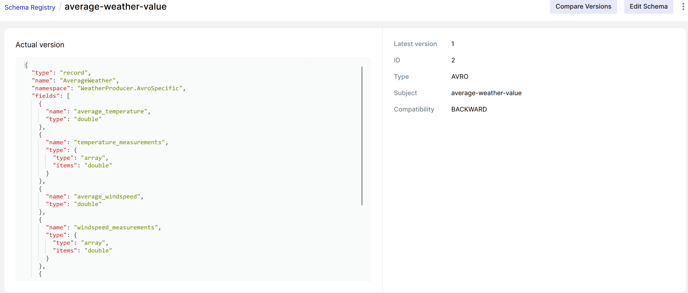

# weather-app 🌤️

## Exercise Streaming

### Setup

Run locally via docker

```bash
cd WeatherApp
docker compose down  --remove-orphans
docker-compose up
```

> ⚠️ Make sure the broker count of the cluster is 3. If for some reasons one or more brokers are missing try to stop & restart docker. 

### Weather Producer & Aggregator

Configure the weather producer/aggregator app under `WeatherApp/WeatherProducer/config/`

Configure kafka via `WeatherApp/WeatherProducer/config/kafka.json`

```json
{
  "servers": "localhost:29092,localhost:39092,localhost:49092", // Initial list of brokers as a CSV list of broker host or host:port
  "schemaRegistry": "http://localhost:8085", // URL to schema registry
  "weatherTopic": "weather",
  "averageWeatherTable": "average-weather",
  "averageTemperatureTopic": "average-temperature",
  "averageWindspeedTopic": "average-windspeed",
  "averageWindchillTopic": "average-windchill",
  "replications": 3, // Number of replications to write 
  "streamApplicationId": "weather-aggregator" // Application id for the stream processing
}
```

Configure cities of which weather data is tracked via  `WeatherApp/WeatherProducer/config/cities.json`

```json
{
  "cities": [
    {
      "partition": 0, // Partiton to write (should be unique)
      "key": "Vienna", // Message key identifier
      "latitude": "48.21",
      "longitude": "16.37"
    },
    ...
  ]
}
```

Generate code from schema

> 🪧Generated code is tracked in the repository, manual generation is not necessary.

```bash
cd WeatherApp/WeatherProducer/schema
dotnet tool install --global Apache.Avro.Tools
```

```bash
avrogen -s .\Weather.avsc  .  --namespace "weather.serialization.avro:WeatherProducer.AvroSpecific" --skip-directories 
avrogen -s .\AverageWeather.avsc  .  --namespace "weather.serialization.avro:WeatherProducer.AvroSpecific" --skip-directories 
```

Run weather producer/aggregator app

```bash
cd WeatherApp/WeatherProducer
dotnet run
```

> ⚠️ The app tries to delete all topics & recreate them at startup. Creating topics can sometimes fail when deleted topics are marked but not yet deleted. If problems arise, try to modify delay in `WeatherApp/WeatherProducer/producer/TopicCreator.cs`.

After a successful start topics & messages should be listed in the kakfa ui located at http://localhost:8080.


The app processes raw weather data from [open meteo](https://open-meteo.com/) and persists it. Each city is written to its own partition.

> Producer is located under `WeatherApp/WeatherProducer/producer/ApiProducer.cs`.



The app then aggregates the raw data into a table; average temperature & windspeed are collected from which the average [windchill](https://de.wikipedia.org/wiki/Windchill) is manually calculated and also persisted.

> Aggregator is located under `WeatherApp/WeatherProducer/aggregator/WeatherAggregator.cs`.







From the aggregated data three steams are created: average-temperature, average-windspeed &  average-windchill.



### Questions

How is the schema validated based on your selected compatibility mode.

Our setup uses the default `Backward` compatibility mode.

From the [Confluent docs](https://docs.confluent.io/platform/current/schema-registry/avro.html#compatibility-types):

* Changes allowed:
  * Delete fields
  * Add optional fields
* Checked against the last schema version
* Upgrade first: Consumers

This is further described in the [Backward Compatibility section](https://docs.confluent.io/platform/current/schema-registry/avro.html#backward-compatibility):

*`BACKWARD` compatibility means that consumers using the new schema can read data produced with the last schema. For example, if there are three schemas for a subject that change in order X-2, X-1, and X then `BACKWARD` compatibility ensures that consumers using the new schema X can process data written by producers using schema X or X-1, but not necessarily X-2. If the consumer using the new schema needs to be able to process data  written by all registered schemas, not just the last two schemas, then  use `BACKWARD_TRANSITIVE` instead of `BACKWARD`. For example, if there are three schemas for a subject that change in order X-2, X-1, and X then `BACKWARD_TRANSITIVE` compatibility ensures that consumers using the new schema X can process data written by producers using schema X, X-1, or X-2.*

To check if schemas were registered one can use

```bash
curl localhost:8085/subjects
# ["average-weather-value", ...]
```

Compatibility can also be queried

```bash
curl localhost:8085/config
# {"compatibilityLevel":"BACKWARD"}
```

These information are also visible in the kafka ui at http://localhost:8080 in the schema registry tab






Run locally via docker

```bash
cd WeatherApp
docker compose down  --remove-orphans
docker-compose up
```

Create topic

```bash
docker exec --interactive --tty broker-1 \
kafka-topics --bootstrap-server broker-1:9092 \
                       --create --topic weather \
                       --partitions 3 \
                       --replication-factor 3
```

#### Weather Producer & Aggregator

Configure Kafka via config found under `WeatherApp/WeatherProducer/config/kafka.json`

```json
{
  "topic": "weather", // Topic name
  "aggregateTopic": "average-temperature", // Aggregate Topic name
  "servers": "localhost:29092,localhost:39092,localhost:49092", // Initial list of brokers as a CSV list of broker host or host:port
  "partitions": 3, // Number of partitions to write 
  "schemaRegistry": "http://localhost:8085" // URL to schema registry
}
```

Generate code from schema

```bash
cd WeatherApp/WeatherProducer/schema
dotnet tool install --global Apache.Avro.Tools
```

```bash
avrogen -s .\Weather.avsc  .  --namespace "weather.serialization.avro:WeatherProducer.AvroSpecific" --skip-directories 
avrogen -s .\AverageWeather.avsc  .  --namespace "weather.serialization.avro:WeatherProducer.AvroSpecific" --skip-directories 
```

Run producer app

```bash
cd WeatherApp/WeatherProducer
dotnet run
```

Check if schemata were registered

```bash
curl localhost:8085/subjects
# ["average-weather-value", ...]
```

Query schema compatibility mode

```bash
curl localhost:8085/config
# {"compatibilityLevel":"BACKWARD"}
```

Read weather data

> Id/Partition 0 => Vienna     
> Id/Partition 1 => London      
> Id/Partition 2 => Berlin

```bash
docker exec --interactive --tty schemaregistry \
kafka-avro-console-consumer --bootstrap-server broker-1:9092 \
                       --topic weather \
                       --property schema.registry.url=http://localhost:8085 
```

Read aggregated stream (average temperature per city)

```bash
docker exec --interactive --tty broker-1 \
kafka-console-consumer --bootstrap-server broker-1:9092 \
                       --topic average-temperature \
                       --property print.key=true
```

#### Questions

How is the schema validated based on your selected compatibility mode.

Our setup uses the default `Backward` compatibility mode.

From the [Confluent docs](https://docs.confluent.io/platform/current/schema-registry/avro.html#compatibility-types):

* Changes allowed:
  * Delete fields
  * Add optional fields
* Checked against the last schema version
* Upgrade first: Consumers

This is further described in the [Backward Compatibility section](https://docs.confluent.io/platform/current/schema-registry/avro.html#backward-compatibility):

*`BACKWARD` compatibility means that consumers using the new schema can read data produced with the last schema. For example, if there are three schemas for a subject that change in order X-2, X-1, and X then `BACKWARD` compatibility ensures that consumers using the new schema X can process data written by producers using schema X or X-1, but not necessarily X-2. If the consumer using the new schema needs to be able to process data  written by all registered schemas, not just the last two schemas, then  use `BACKWARD_TRANSITIVE` instead of `BACKWARD`. For example, if there are three schemas for a subject that change in order X-2, X-1, and X then `BACKWARD_TRANSITIVE` compatibility ensures that consumers using the new schema X can process data written by producers using schema X, X-1, or X-2.*


## Exercise Kafka Setup 

See https://github.com/mse-software-frameworks/weather-app/tree/exercise-setup-kafka


Run locally via docker

```bash
cd WeatherApp
docker-compose down
docker-compose up
```

Create topic

```bash
docker exec --interactive --tty broker-1 \
kafka-topics --bootstrap-server broker-1:9092 \
                       --create --topic weather \
                       --partitions 3 \
                       --replication-factor 3
```

Can be later deleted via

```bash
docker exec --interactive --tty broker-1 \
kafka-topics --bootstrap-server broker-1:9092 \
                       --delete --topic weather
```

#### Weather Producer

Configure Kafka via config found under `WeatherApp/WeatherProducer/config/kafka.json`

```json
{
  "topic": "weather", // Topic name
  "servers": "localhost:9092,", // Initial list of brokers as a CSV list of broker host or host:port
  "partitions": 1 // Number of partitions to write 
}
```

Run producer app

```bash
cd WeatherApp/WeatherProducer
dotnet run
```

Read current messages via

```bash
docker exec --interactive --tty broker-1 \
kafka-console-consumer --bootstrap-server broker-1:9092 \
                       --topic weather
```

Read all messages via

```bash
docker exec --interactive --tty broker-1 \
kafka-console-consumer --bootstrap-server broker-1:9092 \
                       --topic weather \
                       --from-beginning
```

Read specific partition via

```bash
docker exec --interactive --tty broker-1 \
kafka-console-consumer --bootstrap-server broker-1:9092 \
                       --topic weather \
                       --partition 1
```

#### Questions

Analyze how the following things are related

* Number of Brokers
* Number of Partitions
* Number of Replicas
* in.sync.replica Configuration

Our setup consists of 3 brokers. The topic `weather` consist of 3 partitions, so initially the first broker where the topic was created has 3 `weather` partitions which are identified by 0, 1 and 2. However, as the replication factor is set to 3, the two remaining brokers will also eventually share this configuration.

The default [acknowledge mode for Kafka is `acks=all`](https://www.conduktor.io/kafka/kafka-topic-configuration-min-insync-replicas/), this means the producers considers messages as "written successfully" when the message is accepted by all in-sync replicas (ISR).  With `acks=0` a message would be "written successfully" the moment the message was sent without waiting for the broker to accept it at all. 

On default, a topic has `min.insync.replicas=1` so in our setup we can tolerate two brokers being down.

One can retrieve the current topic configuration via

```bash
docker exec --interactive --tty broker-1 \
kafka-topics --bootstrap-server broker-1:9092 \
                       --describe --topic weather
```

Similarly, one can increase the `min.insync.replicas`, in this case to 2

```bash
docker exec --interactive --tty broker-1 \
kafka-configs --bootstrap-server broker-1:9092 \
                       --alter --entity-type topics --entity-name weather --add-config min.insync.replicas=2
```

Now a message is only "written successfully" when two brokers have accepted it. Stopping one broker should not affect functionality

```bash
docker compose stop broker-2
```

However, stopping a second broker leads to insufficient all in-sync replicas

```bash
docker compose stop broker-3
```

```bash
broker1     | org.apache.kafka.common.errors.NotEnoughReplicasException: The size of the current ISR Set(1) is insufficient to satisfy the min.isr requirement of 2 for partition weather-0
```

Restarting a down broker should restore functionality

```
docker compose start broker-2
```

At the end, one can also remove the `min.insync.replicas` constraint again

```bash
docker exec --interactive --tty broker-1 \
kafka-configs --bootstrap-server broker-1:9092 \
                       --alter --entity-type topics --entity-name weather --delete-config min.insync.replicas
```

Now one functional broker is sufficient again for writing messages.

