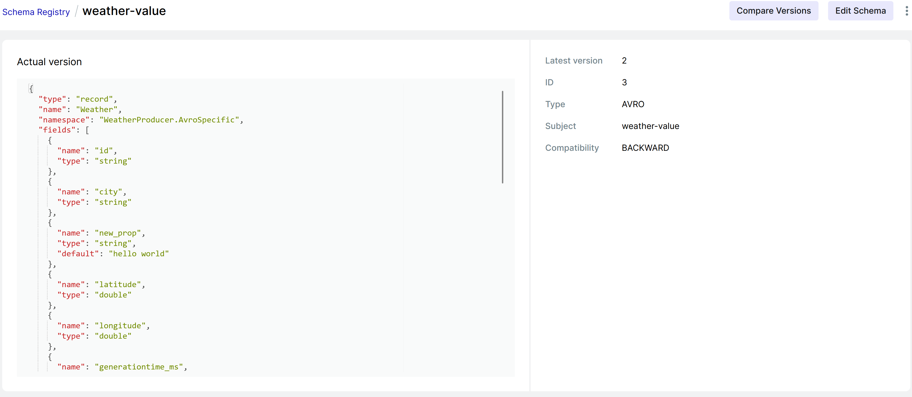
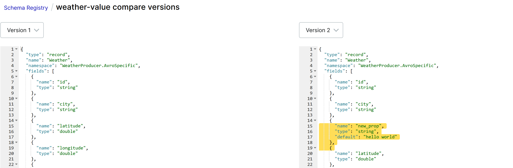

# weather-app 🌤️

## Exercise Streaming

### Setup

Run locally via docker

```bash
cd WeatherApp
docker compose down --remove-orphans
docker-compose up
```

> ⚠️ Make sure the broker count of the cluster is 3. If for some reasons one or more brokers are missing try to stop & restart docker. 

### Weather Producer & Aggregator

Configure the weather producer/aggregator app under `WeatherApp/WeatherProducer/config/`

Configure kafka via `WeatherApp/WeatherProducer/config/kafka.json`

```json
{
  "servers": "localhost:29092,localhost:39092,localhost:49092", // Initial list of brokers as a CSV list of broker host or host:port
  "schemaRegistry": "http://localhost:8085", // URL to schema registry
  "weatherTopic": "weather",
  "averageWeatherTable": "average-weather",
  "averageTemperatureTopic": "average-temperature",
  "averageWindspeedTopic": "average-windspeed",
  "averageWindchillTopic": "average-windchill",
  "replications": 3, // Number of replications to write 
  "streamApplicationId": "weather-aggregator" // Application id for the stream processing
}
```

Configure cities of which weather data is tracked via  `WeatherApp/WeatherProducer/config/cities.json`

```json
{
  "cities": [
    {
      "partition": 0, // Partiton to write (should be unique)
      "key": "Vienna", // Message key identifier
      "latitude": "48.21",
      "longitude": "16.37"
    },
    ...
  ]
}
```

Generate code from schema

> 🪧Generated code is tracked in the repository, manual generation is not necessary.

```bash
cd WeatherApp/WeatherProducer/schema
dotnet tool install --global Apache.Avro.Tools
```

```bash
avrogen -s .\Weather.avsc  .  --namespace "weather.serialization.avro:WeatherProducer.AvroSpecific" --skip-directories 
avrogen -s .\AverageWeather.avsc  .  --namespace "weather.serialization.avro:WeatherProducer.AvroSpecific" --skip-directories 
```

Run weather producer/aggregator app

```bash
cd WeatherApp/WeatherProducer
dotnet run
```

> ⚠️ The app tries to delete all topics & recreate them at startup. Creating topics can sometimes fail when deleted topics are marked but not yet deleted. If problems arise, try to modify delay in `WeatherApp/WeatherProducer/producer/TopicCreator.cs`.

After a successful start topics & messages should be listed in the kakfa ui located at http://localhost:8080.


The app processes raw weather data from [open meteo](https://open-meteo.com/) and persists it. Each city is written to its own partition.

> Producer is located under `WeatherApp/WeatherProducer/producer/ApiProducer.cs`.


The app then aggregates the raw data into a table; average temperature & windspeed are collected from which the average [windchill](https://de.wikipedia.org/wiki/Windchill) is manually calculated and also persisted.

> Aggregator is located under `WeatherApp/WeatherProducer/aggregator/WeatherAggregator.cs`.

> 🪧It may take a while for aggregation to start. Be patient.


From the aggregated data three steams are created: average-temperature, average-windspeed &  average-windchill.


### Questions

#### How is the schema validated based on your selected compatibility mode?

Our setup uses the default `BACKWARD` compatibility mode.

From the [Confluent docs](https://docs.confluent.io/platform/current/schema-registry/avro.html#compatibility-types):

* Changes allowed:
  * Delete fields
  * Add optional fields
* Checked against the last schema version
* Upgrade first: Consumers

This is further described in the [Backward Compatibility section](https://docs.confluent.io/platform/current/schema-registry/avro.html#backward-compatibility):

*`BACKWARD` compatibility means that consumers using the new schema can read data produced with the last schema. For example, if there are three schemas for a subject that change in order X-2, X-1, and X then `BACKWARD` compatibility ensures that consumers using the new schema X can process data written by producers using schema X or X-1, but not necessarily X-2. If the consumer using the new schema needs to be able to process data  written by all registered schemas, not just the last two schemas, then  use `BACKWARD_TRANSITIVE` instead of `BACKWARD`. For example, if there are three schemas for a subject that change in order X-2, X-1, and X then `BACKWARD_TRANSITIVE` compatibility ensures that consumers using the new schema X can process data written by producers using schema X, X-1, or X-2.*

One more important point from the [Confluent docs](https://docs.confluent.io/platform/current/schema-registry/avro.html#specify-schema-compatibility-requirements-per-subject) is that **Kafka Streams only supports FULL, TRANSITIVE, and BACKWARD compatibility**.

*For a plain consumer, it is safe to upgrade the consumer to the new schema after the producer is upgraded because a plain consumer reads only from the input topic. For Kafka Streams, the scenario is different. When you upgrade Kafka Streams, it also can read from the input topic (that now contains data with the new schema). However, in contrast to a plain consumer, Kafka Streams must also be able to read the old schema (from the state/changelog); therefore, only `BACKWARD` compatibility is supported. The Kafka Streams apps must be upgraded first, then it safe to upgrade the upstream producer that writes into the input topic.*

*`FULL` and `TRANSITIVE` compatibility are always supported for Kafka Streams, as they include backward compatibility and so are, in effect, “stronger” settings than `BACKWARD`.*

#### Hands-on: Compatibility analysis

To check if schemas were registered one can use

```bash
curl localhost:8085/subjects
# ["average-weather-value", ...]
```

Compatibility can also be queried

```bash
curl localhost:8085/config
# {"compatibilityLevel":"BACKWARD"}
```

These information are also visible in the kafka ui at http://localhost:8080 in the schema registry tab


The `BACKWARD` compatibility allows to delete fields & add new optional ones. What happens if a new required field is added?

The `Weather.avcs` schema was modified with a new field.

```json
{
  "name": "new_prop",
  "type": "string",
},
```

Then the schema registration code in the `ApiProducer` was modified.

```c#
var subject = SubjectNameStrategy.Topic.ConstructValueSubjectName(_config.WeatherTopic, null);
var weatherSchema = Weather._SCHEMA.ToString();
// Use this to modify schema
await schemaRegistry.RegisterSchemaAsync(subject, new RegisteredSchema(
	subject, 2, 1, weatherSchema, SchemaType.Avro, new List<SchemaReference>()
));
```

Running the app again would result in an expected error at this point:

```c#
Confluent.SchemaRegistry.SchemaRegistryException: Schema being registered is incompatible with an earlier schema for subject "weather-value", details: [Incompatibility{type:READER_FIELD_MISSING_DEFAULT_VALUE, location:/fields/2, message:new_prop, reader:{"type":"record","name":"Weather","namespace":"WeatherProducer.AvroSpecific","fields":[{"name":"id","type":"string"},{"name":"city","type":"string"},{"name":"new_prop","type":"string"},{"name":"latitude","type":"double"},{"name":"longitude","type":"double"},{"name":"generationtime_ms","type":"double"},{"name":"utc_offset_seconds","type":"double"},{"name":"timezone","type":"string"},{"name":"timezone_abbreviation","type":"string"},{"name":"elevation","type":"double"},{"name":"current_weather","type":{"type":"record","name":"CurrentWeather","fields":[{"name":"temperature","type":"double"},{"name":"windspeed","type":"double"},{"name":"winddirection","type":"double"},{"name":"weathercode","type":"int"},{"name":"time","type":"string"}]}}]}, writer:{"type":"record","name":"Weather","namespace":"WeatherProducer.AvroSpecific","fields":[{"name":"id","type":"string"},{"name":"city","type":"string"},{"name":"latitude","type":"double"},{"name":"longitude","type":"double"},{"name":"generationtime_ms","type":"double"},{"name":"utc_offset_seconds","type":"double"},{"name":"timezone","type":"string"},{"name":"timezone_abbreviation","type":"string"},{"name":"elevation","type":"double"},{"name":"current_weather","type":{"type":"record","name":"CurrentWeather","fields":[{"name":"temperature","type":"double"},{"name":"windspeed","type":"double"},{"name":"winddirection","type":"double"},{"name":"weathercode","type":"int"},{"name":"time","type":"string"}]}}]}}]; error code: 409
   at Confluent.SchemaRegistry.RestService.ExecuteOnOneInstanceAsync(Func`1 createRequest)
   at Confluent.SchemaRegistry.RestService.RequestAsync[T](String endPoint, HttpMethod method, Object[] jsonBody)
   at Confluent.SchemaRegistry.RestService.RegisterSchemaAsync(String subject, Schema schema, Boolean normalize)
   at Confluent.SchemaRegistry.CachedSchemaRegistryClient.RegisterSchemaAsync(String subject, Schema schema, Boolean normalize)
   at WeatherProducer.producer.ApiProducer.Produce(TimeSpan interval, CancellationToken cancellationToken) in C:\Arbeit\SFR\weather-app\WeatherApp\WeatherProducer\producer\ApiProducer.cs:line 57
```

To fix this the error one must, as specified by the `BACKWARD` compatibility, make the field optional. In `avro` the default keyword can be used.

```json
{
  "name": "new_prop",
  "type": "string",
  "default": "hello world"
},
```

Running the app again results in a successfully registered schema with the new version 2.






## Exercise Kafka Setup 

See https://github.com/mse-software-frameworks/weather-app/tree/exercise-setup-kafka
