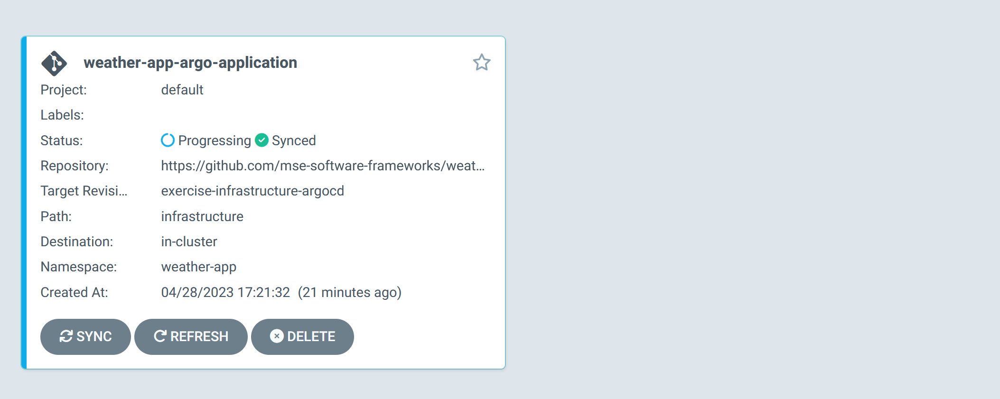

# weather-app 🌤️

## Exercise Cloud-Native Infrastructure

### Setup Kubernetes

>  The following steps were tested under Ubuntu on [WSL2](https://learn.microsoft.com/en-us/windows/wsl/about)

Install lightweight Kubernetes distribution [k3s](https://docs.k3s.io/installation)

```bash
curl -sfL https://get.k3s.io | sh -
```

Start k3s

```bash
sudo k3s server 
```

Check if everything is working

>  Use `kubectl` without sudo
>
> ```bash
> sudo chmod 644 /etc/rancher/k3s/k3s.yaml
> ```

```bash
kubectl cluster-info && kubectl get nodes && kubectl get pods --all-namespaces
```

#### Kubernetes Dashboard

Install Kubernetes dashboard for easy overview

```bash
GITHUB_URL=https://github.com/kubernetes/dashboard/releases
VERSION_KUBE_DASHBOARD=$(curl -w '%{url_effective}' -I -L -s -S ${GITHUB_URL}/latest -o /dev/null | sed -e 's|.*/||')
sudo k3s kubectl create -f https://raw.githubusercontent.com/kubernetes/dashboard/${VERSION_KUBE_DASHBOARD}/aio/deploy/recommended.yaml
```

Dashboard RBAC Configuration & deployment

```bash
cd infrastructure
sudo k3s kubectl create -f dashboard.admin-user.yml -f dashboard.admin-user-role.yml
```

Obtain the bearer token for loign

```bash
sudo k3s kubectl -n kubernetes-dashboard create token admin-user
```

Create channel to access dashboard

```bash
sudo k3s kubectl proxy
```

The dashboard is now accessible at:

- http://localhost:8001/api/v1/namespaces/kubernetes-dashboard/services/https:kubernetes-dashboard:/proxy/
- `Sign In` with the `admin-user` Bearer Token


#### Build Containers for Weather Producer & Weather Backend

To use our .NET apps in orchestrated infrastructure we need to containerize them

```bash
cd WeatherApp
docker build -t weather-producer-image -f Dockerfile.producer .
```

> Remove `WeatherApp.Backend/data` before running `docker build`

```bash
docker build -t weather-backend-image -f Dockerfile.backend .
```

Now the images have to be imported into k3s to make them available in the local container registry of Kubernetes

```bash
cd infrastructure
docker save weather-producer-image | sudo k3s ctr images import --digests -
docker save weather-backend-image | sudo k3s ctr images import --digests -
```

#### Translate Docker Compose to Kubernetes Resources

The Kompose conversion tool makes it easy to convert Docker Compose to  container orchestrators like Kubernetes. We will use this tool to create a baseline for our infrastructure.

Install Kompose

```bash
curl -L https://github.com/kubernetes/kompose/releases/download/v1.26.0/kompose-linux-amd64 -o kompose
chmod +x kompose
sudo mv ./kompose /usr/local/bin/kompose
```

Convert `docker-compose`

```bash
cd infrastructure
kompose convert
```

> ⚠️ Some necessary manual modifications were made to the generated service files as some (internal) port were missing that are required for proper functionality.

With the resources in place, one can now run the infrastructure as a cluster in Kubernetes

```bash
kubectl apply -f .
```

#### Test

Test whether the infrastructure works as expected. To do this, one can inspect the `kafka ui` dashboard.

```
kubectl port-forward deployment/kafka-ui 8080:8080
```

Access UI at http://localhost:8080/ui


One can also check the logs of the .NET applications in the Kubernetes dashboard to see if they work as expected


### GitOps with ArgoCD

Argo CD is a declarative, GitOps continuous delivery tool for Kubernetes. We will use it to deploy & manage our weather-app infrastructure.

Install ArgoCD

```bash
kubectl create namespace argocd
kubectl apply -n argocd -f https://raw.githubusercontent.com/argoproj/argo-cd/stable/manifests/install.yaml
```

Change the argocd-server service type to LoadBalancer

```bash
kubectl patch svc argocd-server -n argocd -p '{"spec": {"type": "LoadBalancer"}}'
```

Forward ArgoCD API Server to 8080

```bash
kubectl port-forward svc/argocd-server -n argocd 8080:443
```

Then get the initial password for the admin-user

```bash
argocd admin initial-password -n argocd
```

> Command requires ArgoCD Cli to be installed. One can obtain it on Mac via
>
> ```bash
> brew install argocd
> ```
>
> or for other systems from https://github.com/argoproj/argo-cd/releases/latest
>
> Alternatively one can obtain the password manually without the cli tool via
>
> ```bash
> kubectl get secret argocd-initial-admin-secret -n argocd -o yaml
> ```
>
> The given password is encoded and can be decoded via `base64 --decode <password>`

And login to https://localhost:8080 using 'admin' and the password.

#### Setup Weather-App Infrastructure

To register infrastructure one must create ArgoCD applications. One can do it via the UI or declare it like in the following via a declarative Kubernetes resource.

```yaml
# argocd.yaml
apiVersion: argoproj.io/v1alpha1
kind: Application
metadata:
  name: weather-app-argo-application
  namespace: argocd
spec:
  project: default

  source:
    repoURL: https://github.com/mse-software-frameworks/weather-app
    targetRevision: exercise-infrastructure-argocd
    path: infrastructure
  destination: 
    server: https://kubernetes.default.svc
    namespace: weather-app

  syncPolicy:
    syncOptions:
    - CreateNamespace=true

    automated:
      selfHeal: true
      prune: true
```

The most important aspects of the configuration are the source and destination properties. The source marks the remote git repository where all infrastructure is declared as IaC. Here we are reusing our existing GitHub repository for it but specifying that ArgoCD should only inspect the `infrastructure` directory of the `exercise-infrastructure-argocd` branch. The destination property marks the target Kubernetes instance. When running Kubernetes locally, like in our case, one can simply use `https://kubernetes.default.svc` for the property.

In the policies section `selfHeal` and `prune` were explicitly specified. That means that local changes to infrastructure (e.g. manually editing the resources by hand) are prohibited and will be automatically reverted. Moreover, removing a resource configuration in the repository will lead to termination and removal of the corresponding running resource in Kubernetes on sync.

Creating the ArgoCD application is the only time one must manually apply a configuration in GitOps. After that ArgoCD will be solely responsible for managing the registered infrastructure.

```bash
kubectl apply -f argocd.yaml
```

Returning to https://localhost:8080 one should see the new application created.



The application is now running and one can now view its resource components, logs, events, and assessed health status.


Our infrastructure seems not to support ArgoCD's health check feature, however it is running fine as visible by the status in the Kubernetes dashboard.


#### GitOps Workflow

To test the configured GitOps environment a second backend resource was created & commited/pushed to the remote git repository.

```yaml
# weather-backend-2-pod.yaml
apiVersion: v1
kind: Pod
metadata:
  annotations:
    kompose.cmd: kompose convert
    kompose.version: 1.26.0 (40646f47)
  creationTimestamp: null
  labels:
    io.kompose.service: weather-backend-2
  name: weather-backend-2
spec:
  containers:
    - image: weather-backend-image
      name: weather-backend-2
      imagePullPolicy: Never
      resources: {}
  restartPolicy: OnFailure
status: {}
```

Now one can wait on default 3 minutes which is the standard manual pull loop for ArgoCD or just click *REFRESH* in the dashboard to pull changes manually. ArgoCD should realize that there is a new commit and for a short period of time it will state *OutOfSync* and flash yellow. Shortly after that the changes should be applied, ArgoCD once again be in sync and a new pod called `weather-backend-2` should be listed and running.


Now, as our ArgoCD application has been configured with pruning support, when one deletes the `weather-backend-2-pod.yaml` config and pushes the change to the repository, ArgoCD will terminate and remove the associated running pod `weather-backend-2`.


### Questions

#### What happens to "manual" changes (changes, directly on the server) in a fully automated GitOps Setup?

GitOps relies on an immutable infrastructure. Manual changes are lost at the latest when a new commit is published that would trigger synchronisation. The infrastructure always strives to match the Git repository.

In ArgoCD, this can be configured even more strictly. If the `selfHeal` option is enabled, manual changes are immediately discarded and reverted to the last committed version.

#### In which situations is a GitOps approach not a good solutions?

Some examples:

* Splitting CI and CD is not possible/easily managable    
  For example, one wants to run smoke tests after deployment. This is a CI step but must run after deployment which would be managed by GitOps. Howevery, GitOps has mostly no direct integration with the CI pipeline.
* Organizations with many releases between environments     
  Often releases are promoted between environments (eg. QA => Stage => Production). However, GitOps doesn’t provide a solution to propagating changes from one  stage to the next one. In fact it even recommends using only a single environment and avoid stage propagation altogether which is not suitable for every organization.
* Heavy use of auto-scaling and dynamic resources    
  GitOps requires the cluster state to match the Git repository after deployment, but dynamic values like replica count and resource limits can cause issues. When the cluster state changes, GitOps tools may try  to sync with the initial value in Git, which may not be desirable.

---

## Exercise Backend & Database

See: https://github.com/mse-software-frameworks/weather-app/tree/exercise-backend%26database

## Exercise Streaming

See: https://github.com/mse-software-frameworks/weather-app/tree/exercise-streaming

## Exercise Kafka Setup 

See https://github.com/mse-software-frameworks/weather-app/tree/exercise-setup-kafka

---

## Sources

* https://docs.k3s.io/quick-start
* https://boxofcables.dev/deploying-rancher-on-k3s-on-wsl2/
* https://www.guide2wsl.com/k3s/
* https://stackoverflow.com/a/73425733
* https://docs.k3s.io/installation/kube-dashboard
* https://learn.microsoft.com/en-us/dotnet/core/docker/build-container?tabs=windows
* https://stackoverflow.com/a/72928176
* https://stackoverflow.com/questions/47928827/how-to-install-rocksdb-into-ubuntu
* https://kubernetes.io/docs/tasks/configure-pod-container/translate-compose-kubernetes/
* https://argo-cd.readthedocs.io/en/stable/operator-manual/declarative-setup/#applications
* https://argo-cd.readthedocs.io/en/stable/getting_started/
* https://www.youtube.com/watch?v=MeU5_k9ssrs
* https://tech.jumia.com/immutable-infrastructure-gitops/
* https://codefresh.io/blog/pains-gitops-1-0/